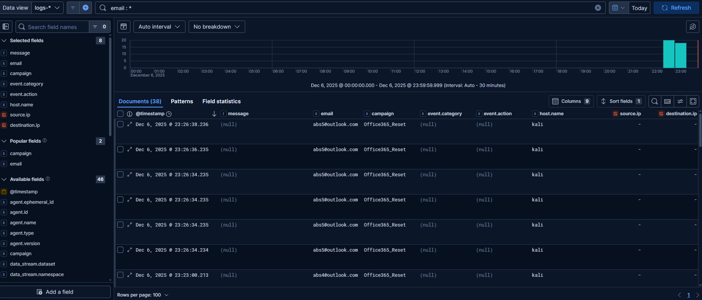
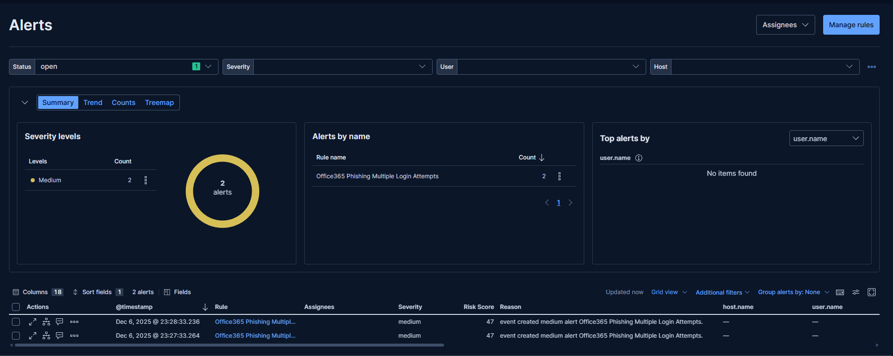
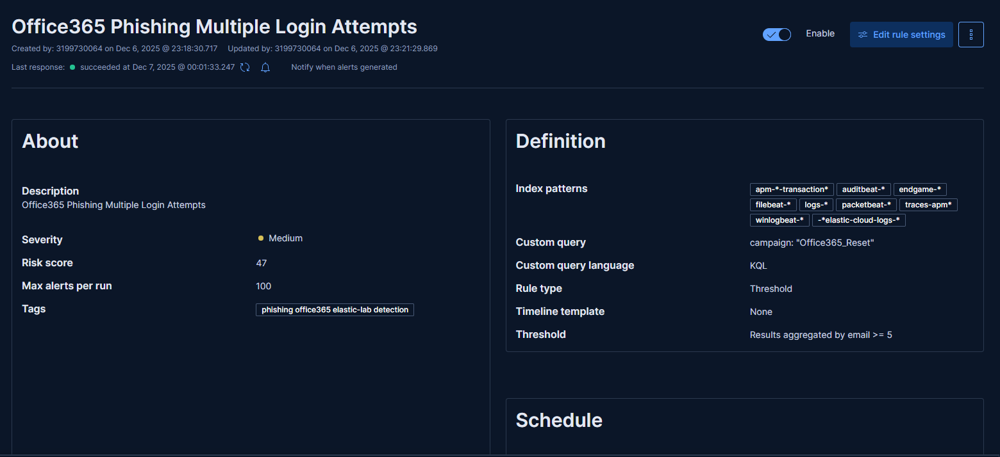
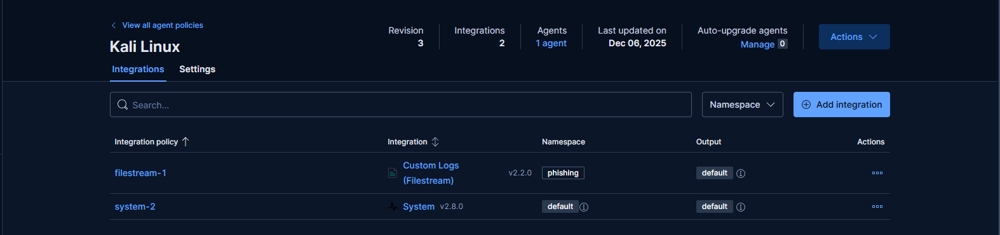

# Office365-Phishing-Detection-Mini-SOC-Lab

Amaç

Bu proje, phishing saldırılarını tespit edebilen bir mini SOC ortamı oluşturarak,
Elastic SIEM’de custom log ingestion, kural geliştirme ve alert üretme becerilerini göstermeyi amaçlar.

Mimari Bileşenler:

| Bileşen                                 | Açıklama                     |
| --------------------------------------- | ---------------------------- |
| Kali Linux                              | Phishing sunucusu            |
| Python Flask                            | Fake Office365 Login Page    |
| JSON Log File (`phishing_attempts.log`) | Kullanıcı giriş logları      |
| Elastic Agent                           | Log’ları SIEM’e aktarım      |
| Elastic Cloud Security                  | SIEM, Rule ve Alert yönetimi |

Phishing Senaryosu

Kurbanlara Office365 “Password Reset” temalı bir sahte giriş ekranı gönderilir.

📌 Kullanıcı formu doldurduğunda log’a şunlar yazılır:

{
  "timestamp": "2025-12-06T19:48:33.007096Z",
  "email": "test@outlook.com",
  "password": "[MASKED]",
  "ip": "127.0.0.1",
  "user_agent": "Mozilla Firefox",
  "campaign": "Office365_Reset"
}

SIEM Entegrasyonu

Elastic Agent → Custom Logs Integration (filestream + ndjson parser)
Loglar başarıyla parse edildi:

📌 Önemli Alanlar:

email
ip
campaign
@timestamp
user_agent

📍 Data View → logs-*

Detection Rule

Rule Name: Office365 Phishing Multiple Login Attempts
KQL Query:

campaign: "Office365_Reset"

Trigger Criteria:

Aynı email adresi için ≥5 başarısız giriş denemesi

Alert Başarılı Çalışma

Birden fazla phishing girişimi sonrası SIEM:
✔ Rule çalıştı
✔ Alert üretildi
✔ Severity: Medium
✔ Risk Score: 47

Geliştirilebilir Özellikler
| Özellik                      | Katma Değer                               |
| ---------------------------- | ----------------------------------------- |
| Slack/Discord Alert          | Anında olay bildirimi                     |
| IP GeoLocation               | Hangi ülkeden saldırı geldi?              |
| Dashboard                    | Görsel izleme kolaylığı                   |
| Credential kullanım kontrolü | Oltalama sonrası lateral movement analizi |

## 📸 Ekran Görüntüleri

### 🔹 1. Microsoft Office Phishing

### 🔹 2. Logs

### 🔹 3. Üretilen Alert

### 🔹 4. Kural

### 🔹 5. Policies

Sonuç

Bu proje, phishing log ingestion + SOC rule + alert lifecycle adımlarını başarıyla gösterir.
Junior SOC Analyst tarafında doğrudan işte yapılan bir senaryodur.

[LinkedIn Profili — Kaan Arda Uzun](https://www.linkedin.com/in/uzunkaana/)
